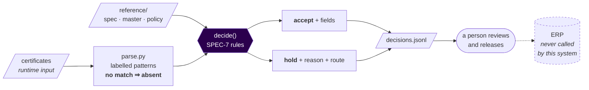

# Thornbury CoA Intake

> **Reads supplier Certificates of Analysis and decides, against SPEC-7, whether a lot is accepted into the ERP or held for a human.**

| Field               | Value                                                                |
| ------------------- | -------------------------------------------------------------------- |
| **Repository type** | Rules engine (batch CLI today; see `REPO-SURFACE.yaml`)               |
| **Status**          | Active — frame built, decision rules not yet built (see `STATUS.md`) |
| **Owner**           | Shadab Hussain (solutioner)                                                    |
| **Last reviewed**   | 2026-08-29                                                         |
| **Engagement**      | thornbury-coa-intake (`SOW-2026-CAP-01`)                                                  |

---

## What this is

Thornbury Ingredients receives several hundred ingredient lots a week, each with a supplier Certificate
of Analysis stating what was tested, by what method, against what limits, and what the result was. Two
analysts read those certificates and key the values into the ERP by hand.

This repo reads the certificate instead. For each document it returns exactly one of two answers:
**accept**, with the fields to create the lot, or **hold**, with a reason written for the person who has
to act on it. The typing is the volume; the judgement is the job. A certificate can be wrong — a
transposed lot number, a result outside the specification with a PASS statement printed over it — and
catching that is the part that matters.

Whatever this system puts in the ERP, Thornbury acts on: purchasing releases against it and production
schedules against it. Releasing a lot that should have been held is a recall conversation with a
customer. Holding a lot that did not need it is an annoyed supplier and a day of delay.

Read `docs/overview.md` next for the shape, `CLAUDE.md` for the engineering contract, and `STATUS.md`
for what is not built.

---

## Architecture sketch

<!--
REQUIRED FOR: Service/API, Data Pipeline, Dashboard/UI, Model/ML
OPTIONAL FOR: Analysis/Exploration (include if the analysis pipeline is non-trivial).

Include a diagram. Prefer a Mermaid block — it lives in the repo, version-controls with the code,
and renders natively in GitHub and Confluence. Show the major components, the data flow, and the
boundaries with other systems. For deeper detail, link to /docs/architecture.md.
-->



Two properties do most of the work. An unrecognised layout yields **nothing** and the lot holds — it
never yields a plausible wrong number ([ADR-0007](decisions/0007-parse-deterministically-and-hold-what-we-cannot-read.md)).
And the system **never releases a lot**: it writes a file, a person releases, exactly as today
([ADR-0004](decisions/0004-the-system-never-releases-a-lot.md)).

For full architecture detail — the trust boundaries, and which reference data is derived versus
hand-authored — see [`docs/architecture.md`](docs/architecture.md).

---

## Local setup

Prerequisites: `git`, `make`, and [`uv`](https://docs.astral.sh/uv/) (which provisions Python itself —
the version is pinned in `.python-version`). Nothing else.

```bash
git clone https://github.com/techwithshadab/thornbury-coa-intake
cd thornbury-coa-intake
.githooks/install-rails.sh   # git never transmits hook config; re-run after every fresh clone
make setup                   # frozen install from uv.lock + pre-commit hooks
make check                   # the whole ritual — hygiene, size, freshness, lint, tests, CVE audit
make submission              # reproduce the three submitted runs from the vendored corpus
```

`make submission` is the shortest path to seeing this work: it runs the pipeline three times over
`engagement/documents`, checks the output with the engagement's own `validate_submission.py`, and
asserts the three runs are byte-identical.

`make check` green on a fresh clone is the bar. If it is not green, that is a defect in this README or
in the repo, not in your machine — say so.

---

## Configuration

<!--
REQUIRED FOR: Service/API, Data Pipeline, Dashboard/UI, Model/ML
OPTIONAL FOR: Analysis/Exploration.

List every environment variable, what it does, whether it's required, and where to get the
value. DO NOT include actual secret values. Reference the secrets manager location instead.
A `.env.example` file should exist in the repo root with placeholders matching this table.
-->

| Variable      | Required | Description                       | Where to get the value             |
| ------------- | -------- | --------------------------------- | ---------------------------------- |
| `EXAMPLE_VAR` | Yes      | _What this configures_            | Key Vault: `kv-name/secret-name`   |

---

## Running the code

The documents path and the reference path are **inputs**, never constants — this pipeline is run against
documents it has not seen.

```bash
# Reproduce the submission from the corpus vendored in this repo
make submission

# Run the pipeline over any directory of certificates
make run DOCS=/path/to/documents OUT=decisions.jsonl

# Equivalently, the CLI directly
uv run coa-intake --documents /path/to/documents --reference reference --out decisions.jsonl

# Re-derive the reference data from the controlled sources (after a SPEC-7 revision)
make reference

# The gates individually
make test        # the suite, incl. the invariant tests
make lint        # ruff check + format --check
make freshness   # is the committed derived reference data stale?
make audit       # dependency CVE gate
```

Check the output's shape with the engagement's validator:

```bash
uv run python engagement/validate_submission.py decisions.jsonl /path/to/documents
```

It checks that the file can be *read* — one line per document, required fields present, dates that mean
one thing. It says nothing about whether any answer is right.

---

## Deployment

<!--
REQUIRED FOR: Service/API, Data Pipeline, Dashboard/UI, Model/ML
OPTIONAL FOR: Analysis/Exploration.

Where this deploys, how it deploys, who can deploy. Include the CI/CD pipeline name, deployment
target, and rollback procedure. If the deployment process is non-trivial, the full detail belongs
in /docs/runbook.md and this section just summarizes.
-->

- **Environments:** none yet. This is a batch CLI run from a workstation. `deployed` and `stateful`
  are declared `false` in `REPO-SURFACE.yaml` and become true at stage 2 below.
- **CI/CD pipeline:** [`.github/workflows/check.yml`](.github/workflows/check.yml) — runs `make check`
  on every PR. **Not yet a required status check**: there is no remote (finding F3).
- **Deploy command or process:** `make run DOCS=<dir> OUT=<file>`, then a person reviews and uploads.
  Stage 1 deliberately does **not** call the ERP — see [`docs/deployment.md`](docs/deployment.md).
- **Rollback procedure:** stage 1 has nothing to roll back — the output is a file that is reviewed
  before it reaches any system. From stage 2, rollback is `git revert` of the policy or code change,
  plus re-running the affected batch. Full detail in the deployment plan.

**The deployment plan is [`docs/deployment.md`](docs/deployment.md)** — four stages, what each
proves, what it costs, and the four things that are unknown with how each becomes known.

---

## Data inputs and outputs

<!--
REQUIRED FOR: Data Pipeline, Analysis/Exploration
OPTIONAL FOR: Service/API (include if data flow is non-obvious), Model/ML (link to training data sources).

Describe what data this reads, what it writes, and the schemas. Include source-of-truth pointers
so a new joiner knows where the data lives and who owns it.
For exploratory work, describe the datasets used and where they came from (table name, snapshot
date, source system, owner).
-->

**Inputs:**

- **Certificate documents** — a directory of `.txt` extractions, passed as `--documents`. Owned by
  Thornbury Supply Operations. A runtime input, never a path inside the program: this pipeline is run
  against documents it has not seen. The supplied corpus is vendored at `engagement/documents/` for
  convenience; that is the Makefile's knowledge, not the program's.
- **Reviewed reference data** — `reference/`, passed as `--reference`.
  - `spec-7.json`, `supplier-master.json` — **derived** by `tools/derive_reference.py` from the
    controlled sources vendored in `reference/source/`. Do not hand-edit; run `make reference`.
  - `policy.json` — **hand-authored** provisional rulings. Owned by named people at Thornbury, listed
    per rule. See [`docs/working-answers.md`](docs/working-answers.md).

**Outputs:**

- **`decisions.jsonl`** — one line per document, `accept` or `hold`, carrying `schema_version`,
  `spec_revision`, and on a hold the `route` and structured `findings`. Consumed by the engagement's
  `validate_submission.py` today; by the ERP lot-creation endpoint from stage 3.
- **Not produced:** an ERP payload. `policy.json` records the `expiry_date ← retest_date` mapping and
  the three fields the ERP cannot store, but no emitter exists — the mapping is a decision awaiting
  Purchasing (Q14), not code awaiting time.

---

## Key decisions

<!--
REQUIRED FOR: all repo types.

Brief summary of the most important non-obvious choices made in this repo. Each significant
decision should have a corresponding ADR (Architecture Decision Record) in /decisions/.
Link to the ADRs here; do not duplicate their content.

If there are no ADRs yet, write them. If you can't articulate why a non-obvious choice was made,
that's the signal that an ADR is needed.
-->

- **`hold` is a conclusion, not a failure** — the judgement is the product, so abstaining is a
  first-class answer. See [ADR-0001](decisions/0001-hold-is-a-first-class-answer-not-a-pipeline-failure.md).
- **Reference data is derived, never hand-kept** — and freshness is not correctness, so the generator
  is verified independently of itself. See [ADR-0002](decisions/0002-derive-the-spec-7-reference-data-instead-of-hand-keeping-it.md).
- **Extraction is a seam; OCR is out of scope** — see [ADR-0003](decisions/0003-treat-extraction-as-a-seam-and-keep-ocr-out-of-scope.md).
- **The system never releases a lot** — it creates at the ERP's default `held`; a person releases.
  See [ADR-0004](decisions/0004-the-system-never-releases-a-lot.md).
- **Holds route to four queues, not one** — 39% held as a single pile would break the team this
  project exists to help. See [ADR-0005](decisions/0005-route-holds-to-four-queues-not-one.md).
- **A date resolves only from the document in front of us** — the rung that inferred a supplier's
  convention from their other certificates was removed on consistency grounds. See
  [ADR-0008](decisions/0008-hold-every-ambiguous-date.md), superseding [ADR-0006](decisions/0006-resolve-dates-by-a-four-step-ladder-and-hold-at-the-bottom.md).
- **Parse deterministically; hold what we cannot read** — an unseen layout must under-read, never
  mis-read. See [ADR-0007](decisions/0007-parse-deterministically-and-hold-what-we-cannot-read.md).

---

## Exploration findings

<!--
REQUIRED FOR: Analysis/Exploration only.
SKIP FOR: all other types.

Summarize the key findings from this exploratory work in business language. What did we learn?
What's the recommendation? What's the confidence level? Link to the detailed notebook(s) or
report(s) for full analysis. This is the section a non-technical reader will read first.
-->

**Skipped — this is a rules engine, not an exploratory repo.** The analytical findings that came out
of reading the corpus live in [`docs/open-questions.md`](docs/open-questions.md) (what the sample
contains) and [`docs/working-answers.md`](docs/working-answers.md) (what it implies for the business).

---

## Known issues and gotchas

<!--
REQUIRED FOR: all repo types.

Things that have tripped up developers, failure modes that are non-obvious, technical debt
being carried, edge cases that aren't handled. Keep this current — if something bites you twice,
it belongs here. This is the section that saves the most time for someone landing on the repo
for the first time.
-->

- **Half the supplied sample (18/36) carries an anomaly**, against the intake lead's estimate of "a
  handful a month" out of ~1,600. Either the sample is enriched for difficulty or the current process
  misses a great deal. **Do not quote rates from this corpus as production estimates.**
- **There is no labelled set.** Every number this repo states about its own behaviour is arithmetic
  over 36 documents, not a measurement. Nothing here is an accuracy claim.
- **`reference/source/` holds a *copy* of a controlled document.** Nobody owns telling this repo that
  SPEC-7 was revised. The staleness gate (`policy.json` → `spec_staleness`) makes the copy expire
  loudly rather than rot silently, but it does not fix the governance gap.
- **`make placeholders` only catches the markers it has been taught.** It has now missed unfilled
  template text twice: once on the fill-me marker in `REPO-SURFACE.yaml`, and once on the
  underscore-bracket marker this template ships, across 32 blocks in this file. If you add a
  template, add its marker to the `placeholders` grep in the Makefile.
- **`uv` is pinned to a managed interpreter** (`python-preference = "only-managed"`). Without it, uv
  adopts any system Python matching `requires-python` — on the machine this was built on, an Anaconda
  3.11.5 with a broken `_ctypes`, which took out the CVE audit.
- **The parser is deliberately brittle in one direction.** A layout it does not recognise yields
  *nothing* and the lot holds. That is the design (ADR-0007), not a bug — do not add a best-effort
  fallback without reading that ADR first.

---

## Operational notes

<!--
REQUIRED FOR: Service/API, Data Pipeline, Dashboard/UI, Model/ML
OPTIONAL FOR: Analysis/Exploration.

Pointer to the runbook with operational detail. Brief summary of the most important
operational facts here so a reader doesn't have to context-switch for the basics.
-->

- **Monitoring:** none — nothing is deployed. Stage 2 of the deployment plan adds run-level counts
  (accepted / held per route) as the first thing worth watching.
- **Logs:** the run prints to stdout/stderr; `decisions.jsonl` is the durable record of what was
  decided and why. There is no log aggregation because there is no service.
- **On-call / support:** none. The solutioner of record (see `engine.yaml`) is the only contact, which
  is itself a handover risk — see [`docs/handover.md`](docs/handover.md).
- **Common operational tasks:** `make reference` after a SPEC-7 revision; `make freshness` to check
  the derived data is current; `make run` for a batch.

---

## What's NOT in this repo

<!--
REQUIRED FOR: all repo types.

Critical for new joiners. List related repos and what they contain so the reader knows where
to look for adjacent functionality. If this repo is part of a larger system, this section is
the map. If a repo was superseded, name the successor here.
-->

- **Nothing, as of the materials being vendored.** `engagement/` now carries the brief, the 36
  certificates, SPEC-7 and the supplied validator, so this repo is one thing to clone rather than two
  to be told about. It is **not our work** — see [`engagement/README.md`](engagement/README.md).
  The corpus remains a runtime *input*: `--documents` is required and no default path exists in
  `src/`, enforced by `tests/test_no_hardcoded_corpus.py`.
- **OCR / PDF extraction.** Out of scope for this build (ADR-0003). The seam is
  `extraction.Extractor`; what productionalising it takes is in
  [`docs/reference/extraction-stub.md`](docs/reference/extraction-stub.md).
- **The ERP integration.** No client for the lot-creation endpoint exists here. Owned by Thornbury IT,
  whose change process is still unknown (Q16) — which is why stage 1 does not depend on it.
- **The review queue.** A held lot reaches a person as a line in a file. No UI, by scope choice.
- **A labelled evaluation set.** Does not exist anywhere yet. It is the highest-value missing thing.
- **Superseded by / supersedes:** nothing. This is the first repo of this engagement.

---

## Contributing

For contribution guidelines, code review standards, and commit message conventions, see the MathCo engineering standards in Confluence.

---

_This README follows the MathCo standard template. Sections marked "Optional" can be omitted if not applicable to this repo's type, but the section header should remain with a brief note explaining why it was skipped (e.g., "Skipped — exploratory repo, no deployment")._
