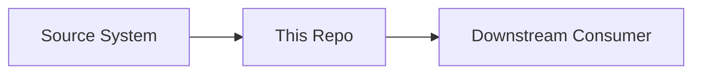

# Thornbury CoA Intake

> **Reads supplier Certificates of Analysis and decides, against SPEC-7, whether a lot is accepted into the ERP or held for a human.**

| Field               | Value                                                                |
| ------------------- | -------------------------------------------------------------------- |
| **Repository type** | Rules engine (batch CLI today; see `REPO-SURFACE.yaml`)               |
| **Status**          | Active — frame built, decision rules not yet built (see `STATUS.md`) |
| **Owner**           | Shadab Hussain (solutioner)                                                    |
| **Last reviewed**   | 2026-08-29                                                         |
| **Engagement**      | thornbury-coa-intake (`SOW-2026-CAP-01`)                                                  |

---

## What this is

Thornbury Ingredients receives several hundred ingredient lots a week, each with a supplier Certificate
of Analysis stating what was tested, by what method, against what limits, and what the result was. Two
analysts read those certificates and key the values into the ERP by hand.

This repo reads the certificate instead. For each document it returns exactly one of two answers:
**accept**, with the fields to create the lot, or **hold**, with a reason written for the person who has
to act on it. The typing is the volume; the judgement is the job. A certificate can be wrong — a
transposed lot number, a result outside the specification with a PASS statement printed over it — and
catching that is the part that matters.

Whatever this system puts in the ERP, Thornbury acts on: purchasing releases against it and production
schedules against it. Releasing a lot that should have been held is a recall conversation with a
customer. Holding a lot that did not need it is an annoyed supplier and a day of delay.

Read `docs/overview.md` next for the shape, `CLAUDE.md` for the engineering contract, and `STATUS.md`
for what is not built.

---

## Architecture sketch

<!--
REQUIRED FOR: Service/API, Data Pipeline, Dashboard/UI, Model/ML
OPTIONAL FOR: Analysis/Exploration (include if the analysis pipeline is non-trivial).

Include a diagram. Prefer a Mermaid block — it lives in the repo, version-controls with the code,
and renders natively in GitHub and Confluence. Show the major components, the data flow, and the
boundaries with other systems. For deeper detail, link to /docs/architecture.md.
-->



For full architecture detail, see [`/docs/architecture.md`](docs/architecture.md).

---

## Local setup

Prerequisites: `git`, `make`, and [`uv`](https://docs.astral.sh/uv/) (which provisions Python itself —
the version is pinned in `.python-version`). Nothing else.

```bash
git clone <this repo> thornbury-coa-intake
cd thornbury-coa-intake
.githooks/install-rails.sh   # git never transmits hook config; re-run after every fresh clone
make setup                   # frozen install from uv.lock + pre-commit hooks
make check                   # the whole ritual — hygiene, size, freshness, lint, tests, CVE audit
```

`make check` green on a fresh clone is the bar. If it is not green, that is a defect in this README or
in the repo, not in your machine — say so.

---

## Configuration

<!--
REQUIRED FOR: Service/API, Data Pipeline, Dashboard/UI, Model/ML
OPTIONAL FOR: Analysis/Exploration.

List every environment variable, what it does, whether it's required, and where to get the
value. DO NOT include actual secret values. Reference the secrets manager location instead.
A `.env.example` file should exist in the repo root with placeholders matching this table.
-->

| Variable      | Required | Description                       | Where to get the value             |
| ------------- | -------- | --------------------------------- | ---------------------------------- |
| `EXAMPLE_VAR` | Yes      | _What this configures_            | Key Vault: `kv-name/secret-name`   |

---

## Running the code

The documents path and the reference path are **inputs**, never constants — this pipeline is run against
documents it has not seen.

```bash
# Run the pipeline over a directory of certificates
make run DOCS=/path/to/documents OUT=decisions.jsonl

# Equivalently, the CLI directly
uv run coa-intake --documents /path/to/documents --reference reference --out decisions.jsonl

# Re-derive the reference data from the controlled sources (after a SPEC-7 revision)
make reference

# The gates individually
make test        # the suite, incl. the invariant tests
make lint        # ruff check + format --check
make freshness   # is the committed derived reference data stale?
make audit       # dependency CVE gate
```

Check the output's shape with the engagement's validator:

```bash
python validate_submission.py decisions.jsonl /path/to/documents
```

It checks that the file can be *read* — one line per document, required fields present, dates that mean
one thing. It says nothing about whether any answer is right.

---

## Deployment

<!--
REQUIRED FOR: Service/API, Data Pipeline, Dashboard/UI, Model/ML
OPTIONAL FOR: Analysis/Exploration.

Where this deploys, how it deploys, who can deploy. Include the CI/CD pipeline name, deployment
target, and rollback procedure. If the deployment process is non-trivial, the full detail belongs
in /docs/runbook.md and this section just summarizes.
-->

- **Environments:** _[dev / staging / prod URLs or identifiers]_
- **CI/CD pipeline:** _[link to pipeline / workflow]_
- **Deploy command or process:** _[steps or link]_
- **Rollback procedure:** _[steps or link]_

For full deployment runbook, see [`/docs/runbook.md`](docs/runbook.md).

---

## Data inputs and outputs

<!--
REQUIRED FOR: Data Pipeline, Analysis/Exploration
OPTIONAL FOR: Service/API (include if data flow is non-obvious), Model/ML (link to training data sources).

Describe what data this reads, what it writes, and the schemas. Include source-of-truth pointers
so a new joiner knows where the data lives and who owns it.
For exploratory work, describe the datasets used and where they came from (table name, snapshot
date, source system, owner).
-->

**Inputs:**

- _[Dataset / table / API]_ — _[schema or link]_ — _[source / owner]_

**Outputs:**

- _[Dataset / table / file / API response]_ — _[schema or link]_ — _[downstream consumers]_

---

## Key decisions

<!--
REQUIRED FOR: all repo types.

Brief summary of the most important non-obvious choices made in this repo. Each significant
decision should have a corresponding ADR (Architecture Decision Record) in /decisions/.
Link to the ADRs here; do not duplicate their content.

If there are no ADRs yet, write them. If you can't articulate why a non-obvious choice was made,
that's the signal that an ADR is needed.
-->

- _[Brief decision summary]_ — see [ADR-001: Title](decisions/001-title.md)
- _[Brief decision summary]_ — see [ADR-002: Title](decisions/002-title.md)

---

## Exploration findings

<!--
REQUIRED FOR: Analysis/Exploration only.
SKIP FOR: all other types.

Summarize the key findings from this exploratory work in business language. What did we learn?
What's the recommendation? What's the confidence level? Link to the detailed notebook(s) or
report(s) for full analysis. This is the section a non-technical reader will read first.
-->

_[For exploratory repos, summarize what was learned and what the recommendation is. State the confidence level and the data caveats.]_

---

## Known issues and gotchas

<!--
REQUIRED FOR: all repo types.

Things that have tripped up developers, failure modes that are non-obvious, technical debt
being carried, edge cases that aren't handled. Keep this current — if something bites you twice,
it belongs here. This is the section that saves the most time for someone landing on the repo
for the first time.
-->

- _[Issue / gotcha and how to handle it]_
- _[Issue / gotcha and how to handle it]_

---

## Operational notes

<!--
REQUIRED FOR: Service/API, Data Pipeline, Dashboard/UI, Model/ML
OPTIONAL FOR: Analysis/Exploration.

Pointer to the runbook with operational detail. Brief summary of the most important
operational facts here so a reader doesn't have to context-switch for the basics.
-->

- **Monitoring:** _[where to look for health / errors]_
- **Logs:** _[where to find logs]_
- **On-call / support:** _[who is responsible for response]_
- **Common operational tasks:** see [`/docs/runbook.md`](docs/runbook.md)

---

## What's NOT in this repo

<!--
REQUIRED FOR: all repo types.

Critical for new joiners. List related repos and what they contain so the reader knows where
to look for adjacent functionality. If this repo is part of a larger system, this section is
the map. If a repo was superseded, name the successor here.
-->

- **Data ingestion:** _[repo name and link]_
- **Downstream consumer:** _[repo name and link]_
- **Shared utilities / common code:** _[repo name and link]_
- **Original exploration / R&D:** _[repo name and link, marked as archived if applicable]_

---

## Contributing

For contribution guidelines, code review standards, and commit message conventions, see the MathCo engineering standards in Confluence.

---

_This README follows the MathCo standard template. Sections marked "Optional" can be omitted if not applicable to this repo's type, but the section header should remain with a brief note explaining why it was skipped (e.g., "Skipped — exploratory repo, no deployment")._
