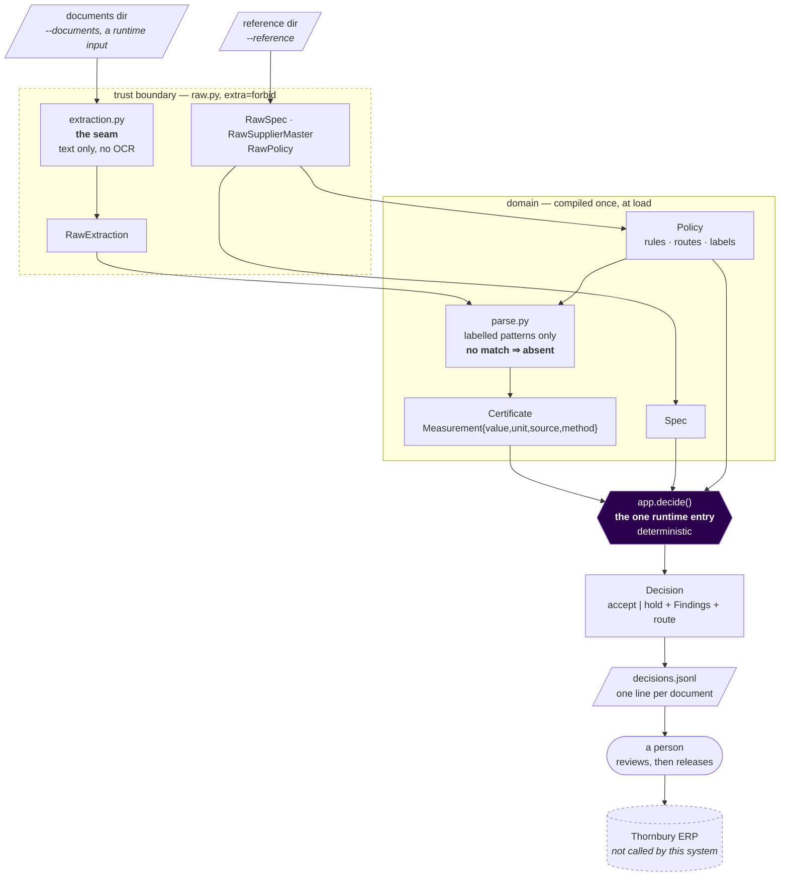
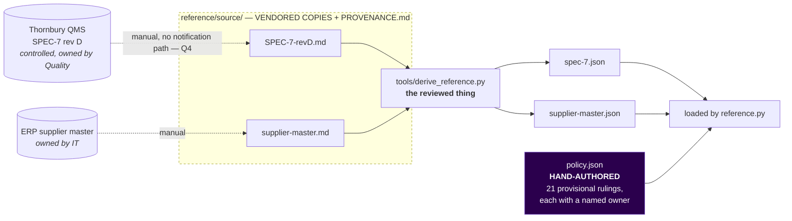

# Architecture

Current state, not intent. Where this conflicts with the code, the code wins.

For *what* this is, read [`overview.md`](overview.md) first. This file is the mechanism: the one
runtime path, where truth enters, and which boundaries exist.

---

## The one canonical path

One entry per concern. `decide()` is the only place a judgement is made, and it makes none of its
own — it walks the specification and the policy.

**The system never reaches the ERP.** It writes a file; a person reviews it and performs the release,
exactly as today ([ADR-0004](../decisions/0004-the-system-never-releases-a-lot.md)). That dashed edge
is the most important line on the diagram — it caps the worst failure this system can produce at *a
wrong field on a held lot*, never a released one.

---

## Where truth comes from

Two kinds of reference data, and confusing them is the easiest way to break this repo.

| | `spec-7.json`, `supplier-master.json` | `policy.json` |
|---|---|---|
| Origin | **Derived** by `tools/derive_reference.py` | **Hand-authored** and reviewed |
| Editing | Never by hand — `make reference` | By hand, with a named owner per rule |
| Gate | `make freshness` (staleness) + `tests/test_derivation.py` (correctness) | `tests/test_policy_consistency.py` |
| Holds | Facts that already exist in a controlled document | Decisions we made on Thornbury's behalf |

**Freshness is not correctness.** `make freshness` compares generator output to generator output — a
backwards derivation passes it. Correctness is established separately, including by re-reading the
source through a different route than the generator uses.

**The dotted edges at the top are the weak link, and no gate in this repo can close them.** Nobody
owns telling this repo that SPEC-7 was revised. The compensating control is the staleness horizon in
`policy.json`: warn from 2027-03-01, refuse to run from 2027-06-01.

---

## Boundaries

| Boundary | What crosses | Enforced by |
|---|---|---|
| **Config** | `COA_WORKSPACE_ROOT`, `--documents`, `--reference` | `paths.py` — the only module in `src/` that reads the environment. Fails closed. `tests/test_path_ownership.py` |
| **Trust** | Certificate text, reference data, policy | `raw.py` — strict models, `extra="forbid"`. An unknown key stops the run |
| **Time** | The clock | Read once, in `cli.main`, passed inward. `decide()` never sees it |
| **Output** | `decisions.jsonl` | `domain.SCHEMA_VERSION`; every line carries it and `spec_revision` |
| **Network / secrets** | *nothing* | No outbound call, no credential ([ADR-0007](../decisions/0007-parse-deterministically-and-hold-what-we-cannot-read.md)) |

---

## The two design choices that shape everything

**Absent, never guessed.** Every field comes from an explicit labelled pattern. A layout the parser
does not recognise yields *nothing*, and the lot holds — it never yields a plausible wrong number.
This is why the vocabulary lives in `policy.json` as `field_labels`: adding a label can only let the
parser *read* something it previously held on. It cannot cause a misread. Widening coverage is
therefore a reviewed data change, and `tests/test_robustness.py` holds 18 plausible layout variations
that must keep passing, because a hold there is lost automation.

**Rules are data.** `app.py` contains no threshold, message, route or ruling. All of it is in
`policy.json` with an owner per rule, so overturning a decision we made on the client's behalf is a
reviewed data change rather than a code edit — which is the only basis on which making those
decisions provisionally was defensible at all.

---

## What is deliberately not here

No service, no database, no scheduler, no ERP client, no model. `REPO-SURFACE.yaml` declares
`deployed`, `stateful`, `handles_secrets` and `external_network` **false**, and names the change that
flips each. [`deployment.md`](deployment.md) sets out the four stages to production and which
questions block each one.
